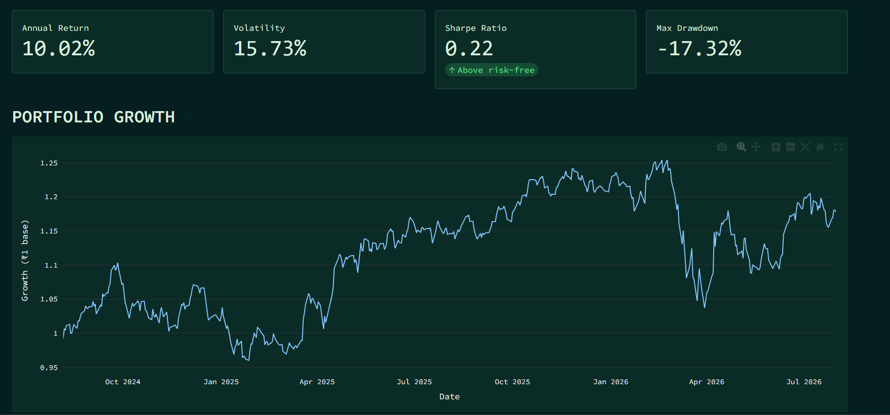
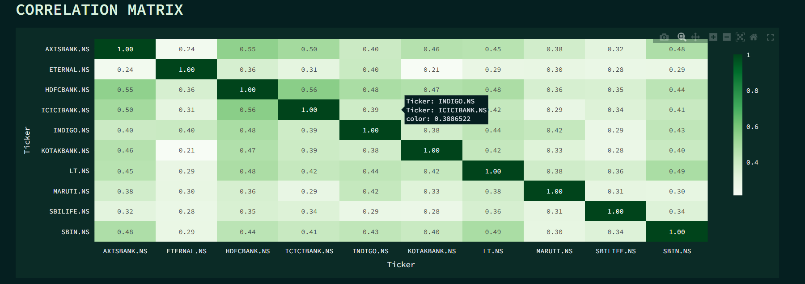
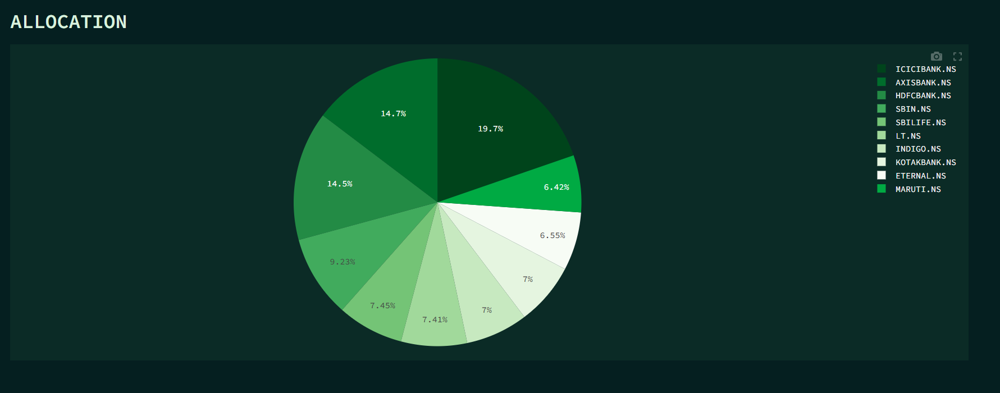

# Portfolio Risk & Performance Analyzer

A portfolio analytics tool that computes risk and performance metrics for
weighted equity portfolios using live market data.

Upload a CSV of holdings and weights; the tool fetches two years of daily
adjusted closing prices from Yahoo Finance and returns annualized return,
volatility, Sharpe ratio, maximum drawdown, pairwise correlation, and a
composite risk score.

## Validation

Output was checked against Value Research's published risk measures for
**HDFC Flexi Cap Fund — Direct Plan** (as of 03 Aug 2026).

| Metric | This tool (top 10 holdings) | Value Research (all 70 holdings) |
|---|---|---|
| Annualized volatility | 15.73% | 12.91% |
| Sharpe ratio | 0.22 | 0.85 |

The divergence is expected and attributable to three factors: this analysis
covers only the fund's top 10 holdings rather than all 70, those 10 are
roughly 65% financials against 36% for the full portfolio, and the window
here is two years of daily returns versus their three years of monthly.

## Metrics

- **Annualized return** — geometric mean of daily returns, scaled by 252 trading days
- **Volatility** — standard deviation of daily returns × √252
- **Sharpe ratio** — excess return over a 6.5% risk-free rate, per unit of volatility
- **Maximum drawdown** — largest peak-to-trough decline over the period
- **Correlation matrix** — pairwise return correlation across holdings
- **Risk score** — a transparent heuristic combining volatility, risk-adjusted
  return, concentration, and holding count. Designed for this tool; not an
  industry-standard model.

## Screenshots





## Stack

Python · Pandas · NumPy · yfinance · Streamlit · Plotly

## Running locally

```bash
pip install -r requirements.txt
streamlit run app.py
```

Portfolio format (`portfolio.csv`):

```csv
Ticker,Weight
ICICIBANK.NS,9.18
AXISBANK.NS,6.84
HDFCBANK.NS,6.77
```

Weights are normalized automatically. NSE tickers require a `.NS` suffix.

## Limitations

- Trailing volatility is a poor predictor of forward risk; correlations
  converge toward 1 during market stress, precisely when diversification
  is most needed.
- The risk-free rate is hardcoded to 6.5% (Indian 10Y G-Sec).
- No adjustment for corporate actions beyond what `auto_adjust` handles.
- `dropna()` on the price frame means a single unavailable ticker will
  silently truncate the dataset.
